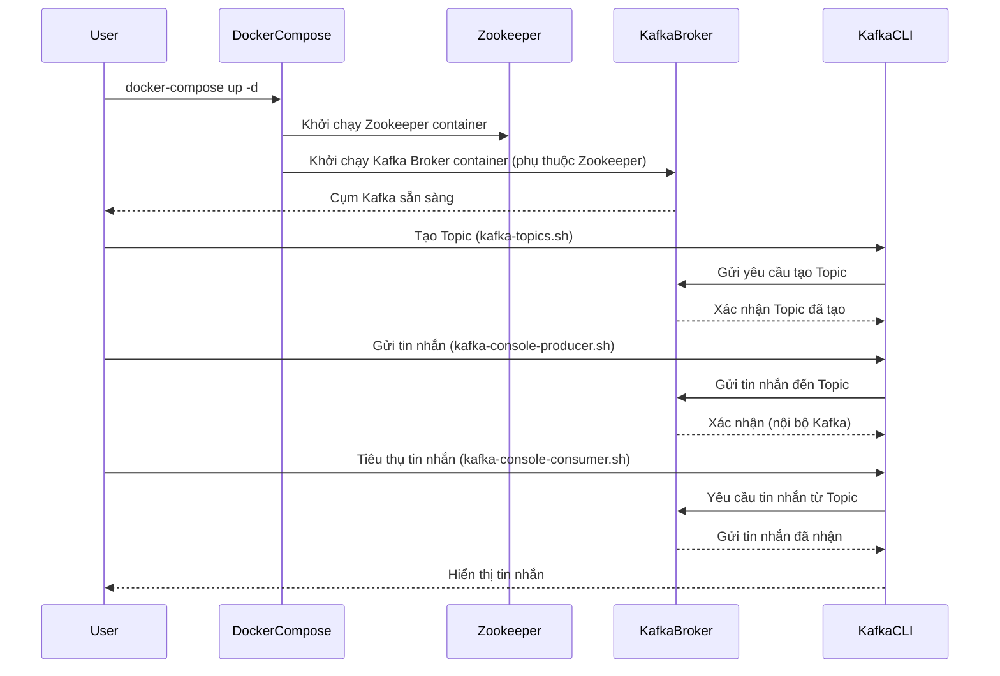

# Tài liệu Thiết kế Kỹ thuật: Module 1 - Kafka Fundamentals (Thực hành)

## 1. Tổng quan

Tài liệu này trình bày thiết kế kỹ thuật cho phần thực hành của Module 1: Kafka Fundamentals, nhằm mục đích giúp người học thiết lập môi trường Kafka cục bộ và làm quen với các khái niệm cốt lõi của Kafka thông qua thực hành trên command line interface (CLI).

## 2. Yêu cầu

### 2.1 Yêu cầu Chức năng

*   Là người học, tôi muốn có thể khởi chạy một cụm Kafka đơn giản (hoặc multi-broker) trên máy cục bộ bằng Docker Compose.
*   Là người học, tôi muốn có thể sử dụng các công cụ Kafka CLI cơ bản (`kafka-topics.sh`, `kafka-console-producer.sh`, `kafka-console-consumer.sh`) để tương tác với cụm Kafka.
*   Là người học, tôi muốn tạo một topic mới với các cấu hình cơ bản (ví dụ: số phân vùng, replication factor).
*   Là người học, tôi muốn gửi tin nhắn từ console producer đến một topic.
*   Là người học, tôi muốn tiêu thụ tin nhắn từ console consumer từ một topic.
*   Là người học, tôi muốn gửi tin nhắn với key và quan sát chúng được gửi đến cùng một phân vùng.

### 2.2 Yêu cầu Phi chức năng

*   **Dễ thiết lập**: Môi trường Kafka phải dễ dàng thiết lập và khởi chạy trên các hệ điều hành phổ biến (Linux, macOS, Windows với WSL2).
*   **Tài nguyên tối thiểu**: Cụm Kafka cục bộ nên sử dụng tài nguyên hệ thống ở mức tối thiểu để phù hợp với máy tính cá nhân.
*   **Độc lập**: Các ví dụ thực hành không nên phụ thuộc vào các dịch vụ bên ngoài khác ngoài Kafka.

## 3. Thiết kế Kỹ thuật

### 3.1. Thay đổi Mô hình Dữ liệu

Không có thay đổi mô hình dữ liệu trực tiếp trong phần thực hành này. Chúng ta sẽ làm việc với các tin nhắn Kafka tiêu chuẩn.

### 3.2. Thay đổi API

Không có thay đổi API code trực tiếp. Chúng ta sẽ sử dụng các lệnh CLI của Kafka, được coi là giao diện tương tác với Kafka.

### 3.3. Thay đổi UI
Không có thay đổi UI trong phần thực hành này.

### 3.4. Luồng Logic

Luồng logic tập trung vào việc thiết lập môi trường và tương tác qua CLI.

### 3.5. Caching Strategy

Không áp dụng chiến lược caching trong phần thực hành này.

### 3.6. Concurrency Handling

Không áp dụng xử lý thao tác đồng thời ở mức ứng dụng trong phần thực hành này, vì các tương tác chủ yếu là thông qua CLI.

### 3.7. Phụ thuộc

*   **Docker**: Để chạy các container Zookeeper và Kafka.
*   **Docker Compose**: Để quản lý việc khởi chạy nhiều container.
*   **Các công cụ Kafka CLI**: Đi kèm với bản phân phối Kafka (thường có sẵn trong container).

### 3.8. Cân nhắc Bảo mật

Không cấu hình bảo mật trong phần thực hành này để đơn giản hóa quá trình thiết lập ban đầu. Mặc định Kafka không có bảo mật.

### 3.9. Cân nhắc Hiệu suất
Hiệu suất không phải là mục tiêu chính của phần thực hành này. Mục tiêu là làm quen với các khái niệm cơ bản.

## 4. Kế hoạch Kiểm tra

*   **Kiểm tra thiết lập môi trường**: Xác minh rằng các container Zookeeper và Kafka Broker chạy thành công và có thể truy cập được.
    *   Sử dụng `docker ps` để kiểm tra các container đang chạy.
    *   Kiểm tra log của các container để đảm bảo không có lỗi khởi động.
*   **Kiểm tra tạo/liệt kê topic**: Xác minh rằng topic có thể được tạo và liệt kê thành công.
    *   Sử dụng `kafka-topics.sh --create` và `kafka-topics.sh --list`.
*   **Kiểm tra gửi/nhận tin nhắn**: Xác minh rằng tin nhắn có thể được gửi và nhận thành công giữa producer và consumer.
    *   Sử dụng `kafka-console-producer.sh` và `kafka-console-consumer.sh`.
*   **Kiểm tra gửi tin nhắn với key**: Xác minh rằng tin nhắn với key được gửi đến cùng một phân vùng.
    *   Sử dụng `kafka-console-producer.sh --property parse.key=true --property key.separator=:` và quan sát đầu ra của consumer.

## 5. Câu hỏi Mở

*   Chúng ta có cần cung cấp một bản cài đặt Kafka CLI riêng biệt cho người dùng không, hay chỉ cần hướng dẫn sử dụng các lệnh bên trong container Docker? (Hiện tại, tôi giả định sẽ hướng dẫn sử dụng CLI bên trong container).
*   Có cần thêm các bài tập về việc mô phỏng lỗi broker và quan sát hành vi của cụm không? (Hiện tại, tôi không đưa vào để giữ phần này đơn giản nhất).

## 6. Các Phương án Đã Xem xét

*   **Cài đặt Kafka trực tiếp trên máy cục bộ**: Phương án này bị từ chối vì quá trình cài đặt và cấu hình phức tạp hơn, có thể gây ra nhiều lỗi phụ thuộc và khó khăn trong việc quản lý phiên bản cho người học. Sử dụng Docker cung cấp một môi trường cô lập và dễ dàng tái tạo.
*   **Sử dụng các công cụ GUI**: Bị từ chối để tập trung vào việc hiểu các khái niệm cơ bản thông qua CLI, giúp người học làm quen với các lệnh gốc của Kafka.
