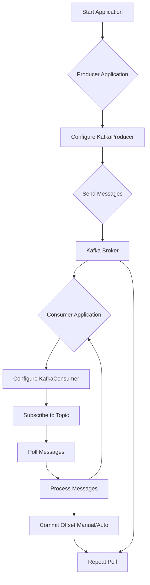

# Tài liệu Thiết kế Kỹ thuật: Module 2 - Kafka Architecture & Components Deep Dive (Thực hành)

## 1. Tổng quan

Tài liệu này trình bày thiết kế kỹ thuật cho phần thực hành của Module 2: Kafka Architecture & Components Deep Dive. Mục tiêu là giúp người học hiểu sâu hơn về kiến trúc và các thành phần cốt lõi của Kafka (Producers, Consumers, Consumer Groups, Replication) thông qua việc xây dựng các ứng dụng Java client cơ bản.

## 2. Yêu cầu

### 2.1 Yêu cầu Chức năng

*   Là người học, tôi muốn có thể xây dựng một ứng dụng Java Producer cơ bản để gửi tin nhắn đến Kafka.
*   Là người học, tôi muốn có thể cấu hình Producer với các tùy chọn `acks`, `retries`, và `enable.idempotence` để hiểu ảnh hưởng của chúng đến độ bền và hiệu suất.
*   Là người học, tôi muốn có thể xây dựng một ứng dụng Java Consumer cơ bản để tiêu thụ tin nhắn từ Kafka.
*   Là người học, tôi muốn có thể quản lý offset thủ công trong Consumer để kiểm soát chính xác việc commit tiến độ.
*   Là người học, tôi muốn hiểu cơ chế Consumer Group và cách các consumer trong cùng một group chia sẻ phân vùng.

### 2.2 Yêu cầu Phi chức năng

*   **Dễ hiểu và thực thi**: Các ví dụ code phải đơn giản, rõ ràng và dễ dàng chạy trên môi trường đã thiết lập ở Module 1.
*   **Hiệu suất chấp nhận được**: Các ví dụ nên được thiết kế để minh họa các khái niệm, không nhất thiết phải tối ưu hóa hiệu suất ở mức production.
*   **Tái sử dụng**: Các đoạn code Producer/Consumer có thể được tái sử dụng và mở rộng cho các module sau.

## 3. Thiết kế Kỹ thuật

### 3.1. Thay đổi Mô hình Dữ liệu

Không có thay đổi mô hình dữ liệu cụ thể trong phần này, chúng ta vẫn làm việc với các tin nhắn Kafka tiêu chuẩn (key-value pairs).

### 3.2. Thay đổi API

Chúng ta sẽ sử dụng Kafka Client API của Java (`org.apache.kafka.clients.producer.KafkaProducer`, `org.apache.kafka.clients.consumer.KafkaConsumer`).

### 3.3. Thay đổi UI
Không có thay đổi UI trong phần thực hành này.

### 3.4. Luồng Logic

Luồng logic tập trung vào việc lập trình các ứng dụng Producer và Consumer bằng Java, và quan sát hành vi của chúng dưới các cấu hình khác nhau.

### 3.5. Caching Strategy

Không áp dụng chiến lược caching trong phần thực hành này.

### 3.6. Concurrency Handling

Chúng ta sẽ xem xét concurrency ở mức Consumer Group (nhiều Consumer instance trong cùng một group) và cách Kafka tự động gán phân vùng, nhưng không đi sâu vào thread-level concurrency trong ứng dụng Java.

### 3.7. Phụ thuộc

*   **Java Development Kit (JDK)**: Phiên bản 21.
*   **Gradle**: Để quản lý project và dependencies.
*   **`org.apache.kafka:kafka-clients`**: Phiên bản tương thích với Kafka Broker (ví dụ: 7.0.1).
*   **Môi trường Kafka cục bộ**: Được thiết lập và chạy từ Module 1.

### 3.8. Cân nhắc Bảo mật

Không cấu hình bảo mật trong các ví dụ code này để tập trung vào các khái niệm cốt lõi. Người học sẽ kết nối đến broker không bảo mật từ Module 1.

### 3.9. Cân nhắc Hiệu suất
Các ví dụ sẽ được thiết kế để minh họa khái niệm, không phải để tối ưu hóa hiệu suất. Tuy nhiên, chúng ta sẽ quan sát ảnh hưởng của các cấu hình Producer (`acks`, `retries`, `idempotence`) đến độ trễ và thông lượng.

## 4. Kế hoạch Kiểm tra

*   **Kiểm tra Producer**:
    *   Gửi tin nhắn với `acks=0`, `acks=1`, `acks=all` và xác minh hành vi gửi.
    *   Mô phỏng lỗi broker (tắt/khởi động lại) và quan sát hành vi của Producer với/không có `retries` và `enable.idempotence`.
*   **Kiểm tra Consumer**:
    *   Chạy Consumer và xác minh nó tiêu thụ tin nhắn từ topic.
    *   Kiểm tra việc commit offset thủ công bằng cách dừng consumer và khởi động lại.
    *   Chạy nhiều Consumer trong cùng một group để quan sát phân vùng được gán.
*   **Kiểm tra ngữ nghĩa phân phối**: Quan sát có mất hoặc trùng lặp tin nhắn hay không dưới các cấu hình Producer khác nhau.

## 5. Câu hỏi Mở

*   Có cần cung cấp một project template Maven/Gradle cho các ví dụ Java không, hay chỉ cần hướng dẫn cách tạo project từ đầu? (Hiện tại giả định hướng dẫn tạo từ đầu).
*   Có cần minh họa cơ chế `max.in.flight.requests.per.connection` không? (Hiện tại không đưa vào để giữ trọng tâm).

## 6. Các Phương án Đã Xem xét

*   **Sử dụng Spring Kafka**: Bị từ chối ở module này để tập trung vào Kafka Client API gốc, giúp người học hiểu rõ hơn về cách Kafka hoạt động ở cấp độ thấp. Spring Kafka sẽ được giới thiệu ở Module 5.